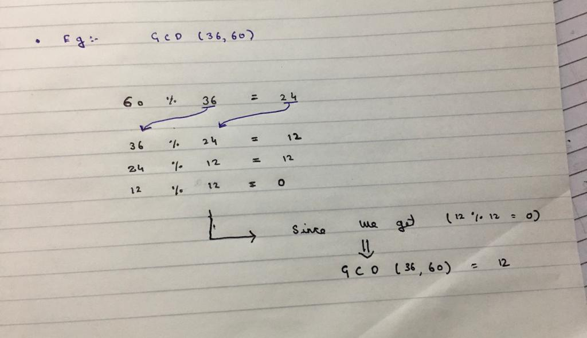
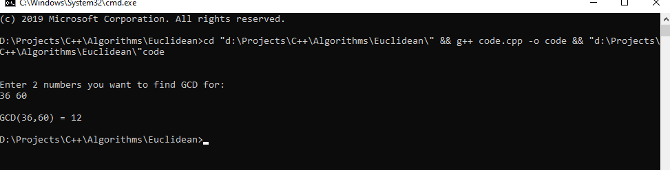

# Euclidean Algorithm

## Logic behind the Euclidean Algorithm

This algorithm is used to find GCD of two numbers. If we subtract smaller number from larger, GCD doesn't change. The image explains the entire logical process with an example.

## Output for the code

## Library Used

>#include "iostream"

### Thanks For Reading
